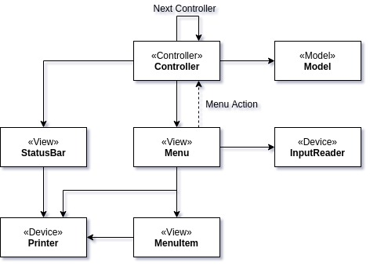

# auto1-demonio-rpg

Project that I used as an example of how to implement an MVC Pattern using only the Java language.

## Prerequisites

* JDK 11
* Apache Maven 3.6.0

## Goal

Program a command-line-based Role Playing Game.

## Considerations

It was created using the MVC Pattern.




## Improvements

* A map which shows the whole world, at least the part that is known.
* Character customization.
* Better level-up / level-down algorithms.
* Other kinds of monsters.
* Better player statics.

##  How to Compile Source Code (Maven is required!)

Project is based on Maven and can be built using the following command:

```
mvn clean package
```

## How to Run?

### IDE

Just execute `br.tech.desiderati.demo.demonio.controller.StartController` class.

### JAR

```
java -jar target/demo-auto1-demonio-rpg-0.0.1-SNAPSHOT.jar
```
